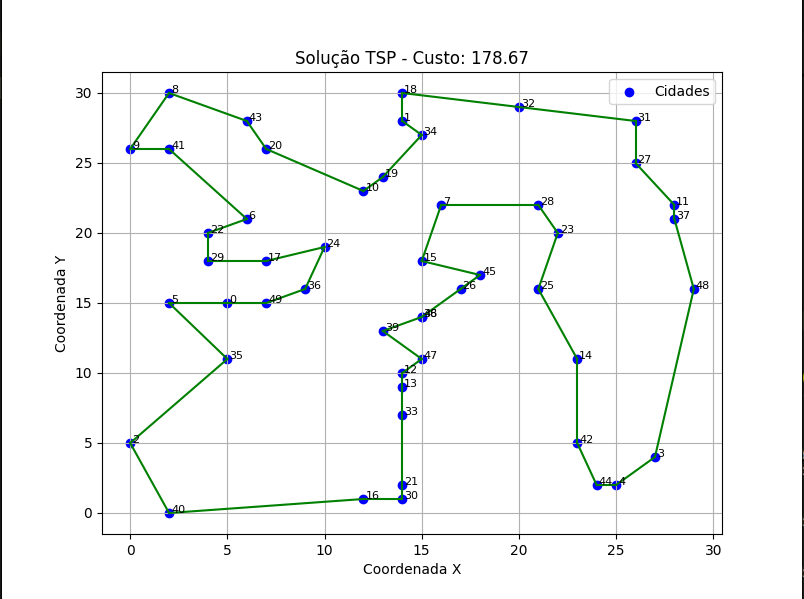

# Sobre o Projeto

Este projeto foi desenvolvido como parte da disciplina de Otimização, do curso de Ciência da Computação do IFPR – Campus Pinhais.

O trabalho tem como objetivo implementar e analisar abordagens heurísticas em Python para a resolução do Problema do Caixeiro Viajante (TSP – Travelling Salesman Problem), um dos problemas clássicos da área de otimização combinatória.

## Problema Abordado

O Problema do Caixeiro Viajante consiste em determinar a menor rota possível que permita a um viajante:

* Visitar um conjunto de cidades exatamente uma vez
* Retornar à cidade de origem
* Minimizar a distância total percorrida

Por se tratar de um problema NP-difícil, soluções exatas tornam-se inviáveis para instâncias maiores, o que justifica o uso de heurísticas e métodos aproximados.

## Abordagem Utilizada

Neste trabalho, foi adotada uma estratégia em duas etapas:

1. Construção de Soluções Iniciais

Foram utilizadas duas heurísticas distintas:

* Heurística do Vizinho Mais Próximo (Gulosa) constrói uma rota escolhendo sempre a cidade mais próxima ainda não visitada.
* Heurística de Inserção Aleatória gera uma solução inicial mais diversificada, inserindo cidades em posições que minimizam o custo incremental.

2. Otimização com Busca Local (3-opt)

Após a geração das soluções iniciais, foi aplicado o algoritmo 3-opt, uma técnica de otimização local que:

* Remove três arestas da rota atual.
* Reconecta os segmentos de diferentes formas.
* Aceita modificações que reduzem o custo total.

Esse processo é repetido iterativamente até que não sejam encontradas melhorias adicionais.

## Objetivo do Trabalho

O foco principal do projeto é:

* Comparar diferentes formas de construção de soluções iniciais
* Avaliar o impacto da otimização local (3-opt) na qualidade das rotas
* Demonstrar, na prática, a aplicação de técnicas heurísticas em problemas NP-difíceis

## Considerações sobre Desempenho

A implementação prioriza a qualidade das soluções em detrimento do tempo de execução.

O uso do algoritmo 3-opt, apesar de produzir resultados significativamente melhores, possui custo computacional elevado, especialmente para instâncias com maior número de cidades.

### O sistema gera:

1. Custos das soluções iniciais
2. Custos após otimização
3. Comparação entre abordagens
4. Visualização gráfica da melhor rota encontrada

## Análise dos resultados:

A instância analisada é composta por 50 cidades, distribuídas em um plano cartesiano bidimensional, cujas coordenadas foram utilizadas para o cálculo da matriz de distâncias euclidianas.

Após a aplicação das heurísticas de construção inicial (gulosa e inserção aleatória) seguidas da otimização local com o algoritmo 3-opt, foi obtida uma solução com custo total de:

#### **`178.67`**

### Interpretação da Solução

A figura gerada apresenta:

* 🔵 Pontos azuis: representam as cidades
* 🟢 Linhas verdes: representam o caminho percorrido pelo caixeiro

Observa-se que a rota final:

* Conecta todas as cidades sem repetições
* Retorna à cidade inicial, formando um ciclo fechado
* Evita cruzamentos desnecessários na maior parte do trajeto

### Resultado gráfico:

Teste feito para 50 coordenadas:

## Conclusão

Este projeto demonstra como a combinação de heurísticas construtivas com técnicas de busca local pode produzir soluções eficientes para problemas complexos, mesmo na ausência de algoritmos exatos viáveis.

Além disso, reforça a importância do equilíbrio entre qualidade da solução e custo computacional, um dos principais desafios na área de otimização.

Neste repositório há mais arquivos para a realização de testes com diferentes coordenadas e em maiores quantidades.
